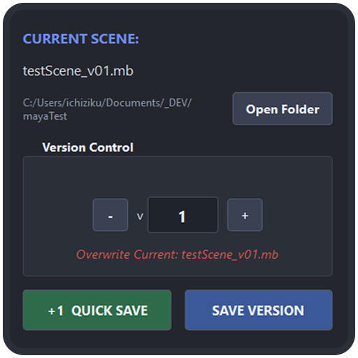

  

<h1 align="center">Maya Version Saver</h1>

  Version Control & File Management for Autodesk Maya

---

### Main Window

  

## Features

* **Smart Version Parsing:** Automatically detects existing version numbers in filenames (e.g., `character_v01.ma`, `asset_v002.mb`) and preserves padding style.
* **Visual Version Preview:** Real-time preview showing exactly how the new filename will look, with color-coded feedback:
  * **Green:** Saving as a new version
  * **Red:** Overwriting existing version
* **Quick Save Workflow:** One-click "+1 & QUICK SAVE" button increments version and saves immediately.
* **Overwrite Protection:** Confirmation dialog appears when attempting to overwrite an existing file.
* **Open Folder Shortcut:** Direct access to the scene's folder from the UI.
* **In-View Feedback:** Visual confirmation message appears in Maya's viewport after successful save.
* **Preserves File Extensions:** Maintains correct file type (`.ma` or `.mb`) based on the current scene.

## Installation

1. Copy the code from **[`mayaVersionSaver.py`](mayaVersionSaver.py)**.
2. Open the **Script Editor** in Maya and paste the code into a **Python** tab.
3. Highlight the code and drag it to your **Shelf** to create a shortcut icon.
4. You can also **[download the icon](assets/versionSaver_icon.png)** from the `assets` folder and use it in your shelf.

## Usage

1. Open a saved Maya scene (or start a new one and save it first).
2. Run the script to open the Version Saver dialog.
3. The UI will display:
   * Current scene name with version number
   * File path (or "Not saved yet!" if unsaved)
   * Version control spinner with +/- buttons
4. **To save a new version:**
   * Use the + button or spinner to increase the version number
   * Click **"SAVE VERSION"**
5. **For quick version increment:**
   * Click **"+1 & QUICK SAVE"** — automatically increments version and saves in one action
6. If the target version already exists, you'll be prompted to confirm overwrite.

## Version Format Support

The tool intelligently parses various version formats:

| Original File | Detected Base | Version | Padding | Saves As |
|--------------|---------------|---------|---------|----------|
| `prop_v01.ma` | `prop_` | 1 | 2 | `prop_v02.ma` |
| `asset_v001.mb` | `asset_` | 1 | 3 | `asset_v002.mb` |
| `character_v002_final.ma` | `character_` | 2 | 3 | `character_v003_final.ma` |
| `scene_v2.ma` | `scene_` | 2 | 1 | `scene_v3.ma` |
| `untitled.ma` | `untitled` | 1 | 2 | `untitled_v01.ma` |

## Requirements

- Autodesk Maya 2017 or newer
- PySide2 or PySide6 (included with modern Maya versions)

## Notes

- The tool saves files in the **same directory** as the current scene.
- If the scene has never been saved, you'll be prompted to save it manually first.
- File type (`.ma` or `.mb`) is preserved from the original scene.
- Version padding (e.g., `v01` vs `v001`) is automatically detected and maintained.
---
